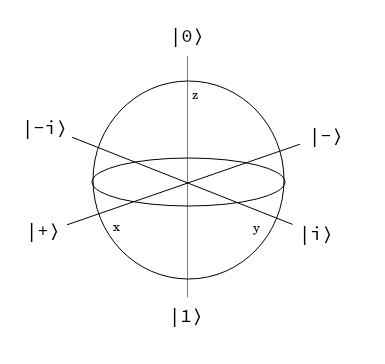

# Qubit Phases

To understand how gates will affect a qubit, it is essential to understand the phases of qubit.

An easy way to understand this is going back to the Bloch Sphere. The equatorial plane contains the X and Y axis which represent the various phases of the qubit.

While on this equatorial plane regardless of phase, the qubit has an equal probability of collapsing to |0⟩ or |1⟩. The vector representation can be pointing in any direct on the X or Y axis, hence any phase.

|+⟩ or |-⟩ are used to represent the different phase values along the x-axis. 

|i⟩ or |-i⟩ are used to represent the different phase values along the y-axis.

Outside of the equatorial plane the qubit will still contain phase information along the x or y axis, but the probabilities of collapsing into either |0⟩ or |1⟩ has changed.

## Mathematical Notation of Phases

When the qubit is in an equal probability superposition with no phase it will be represented as 

    |+⟩ = (1/√2) (|0⟩ + |1⟩) 

It's still marked as ket + even though has no phase state, and is often referred to as the "default" or "reference" state.

### X-basis states:

    |+⟩ = (1/√2) (|0⟩ + |1⟩)
    |-⟩ = (1/√2) (|0⟩ - |1⟩) 

### Y-basis states:

    |i⟩ = (1/√2) (|0⟩ + i|1⟩)
    |-i⟩ = (1/√2) (|0⟩ - i|1⟩) 

## Phase kickback

While mentioning phases, a fundamental concept in quantum computing is phase kickback. This is the process where the phase of one qubit is transferred to another qubit during a "controlled operation", such as a controlled-NOT (CNOT).