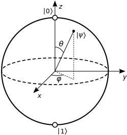

# What is a qubit?

A qubit is quite unlike a classical bit. Its state can be represented as a vector in a two-dimensional complex vector space. This can be represented as a bloch sphere as a way to help visualise the complex number space.

As a refresher, a complex number is not a real number and is an extension that allows numbers to be represented in the y-axis (imaginary), in addition to the x-axis (real numbers).

## Bloch Sphere

If you have a 2D vector, this can be represented on a grid with X and Y axis. The vector will have a positive or negative value in a particular direction.

Adding complex numbers now adds another axis, as complex numbers operate on the Y axis of a typical number line.

This is how we transition to the beginning concept of a Bloch sphere. Each point on the sphere represents a unique state.

"Esfera de Bloch" by Smite-Meister is licensed under Wikimedia Commons and is available at (https://es.wikipedia.org/wiki/Esfera_de_Bloch)

The Bloch Sphere is only designed to represent pure quantum states, not mixed states. A pure state is when you know the vector of the qubit, whereas mixed states refer to the time it is in a probabilitic state, or any state of uncertainty, including entanglement.

## Basis States

    |0⟩ (pronounced "ket 0")

    |1⟩ (pronounced "ket 1")

These are the 2 basis states a qubit can hold. When a qubit is measured, it will collapse into one of these states. In the Bloch Sphere, |0⟩ is usually north and |1⟩ south.

Qubits are commonly represented as column vectors.

    |0⟩ = | 1 |
          | 0 |

    |1⟩ = | 0 |
          | 1 |

## Tensor product

⊗ denotes a tensor product, which is a way of combining multiple qubit values into a single value

Comparing to a classical system we can combine 3 qubits into their classical counterparts.

    |0⟩ ⊗ |1⟩ ⊗ |1⟩ ≡ |011⟩ ≡ |3⟩

Note this equals ket 3 and not just 3. The ket 3 represents the qubits and their current state. If you were to measure each qubit at that point it would return 3, but you could continue to perform further quantum operations on the qubits.

## Superposition

Superposition is when the qubit is a state that is a combination of |0⟩ and |1⟩ and contains certain probabilities on whether it will collapse as either |0⟩ or |1⟩.

    |ψ⟩ (pronounced "ket psi" or "ket sigh")

This is the representation of a qubit in superposition. It can also be thought of as the vector or value of the qubit in a mathematical sense.

To represent the state or amplitude of a qubit in superposition, the values α and β are used against the |0⟩ and |1⟩ respectively.

α|0⟩ represents the amplitude of the qubit toward the |0⟩ state.

β|1⟩ represents the amplitude of the qubit toward the |1⟩ state.

The amplitude itself is not the probability. |α|² and |β|² represent the probabilities. Meaning that |α|² + |β|² = 1

To sum this up, we can now realise that |ψ⟩ = α|0⟩ + β|1⟩ is the superposition value. The superposition value can be represented on a Bloch Sphere.

Represented as a column vector:

    |ψ⟩ = α|0⟩ + β|1⟩ = |α|
                        |β|

